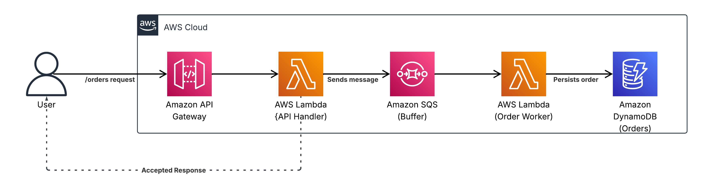

# Serverless Queue Worker - Resilient Serverless Order Processing on AWS



This project implements a serverless API backend on AWS for asynchronous data processing, using the Producer-Consumer pattern.
It is designed to handle high-throughput data ingestion by decoupling the initial request handling from the actual data processing logic via an SQS queue.
The entire infrastructure is defined and managed with Terraform, with a separate state backend configuration to mirror a production-grade setup.

## Architecture & Components

1. **API Gateway (HTTP API):** Provides a publicPOST /ordersendpoint for data ingestion.
2. **Producer Lambda (api_handler):** A Python function that validates the incoming payload, enriches it with metadata (orderId,createdAt), and sends it to an SQS queue.
3. **SQS Queue:** Acts as a durable, persistent buffer between the producer and consumer, ensuring no data is lost.
4. **Consumer Lambda (order_worker):** A Python function triggered by new SQS messages. It processes the data and persists it to DynamoDB.
5. **DynamoDB Table:** A NoSQL database for storing the processed order data, withorderIdas the primary key.

## Cost Analysis

This project is designed to be extremely cost-effective by leveraging the AWS Free Tier. All services used fall within the Free Tier limits for typical development and testing workloads.
* **AWS Lambda:** 1 million free requests per month.
* **Amazon API Gateway (HTTP API):** 1 million free requests for the first 12 months.
* **Amazon SQS:** 1 million free requests per month.
* **Amazon DynamoDB:** 25 GB of free storage and 25 provisioned WCUs/RCUs.
Under normal, low-traffic usage, the monthly cost for this infrastructure should be **$0.00**.

## Deployment & Testing

### Prerequisites
* An AWS Account
* Terraform (>= 1.0) installed
* AWS CLI (run aws configure)

### Deployment Steps

**Step 1: Deploy the Remote State Backend**
This step creates the S3 bucket and DynamoDB table for storing Terraform's state.
````
bash`
$ cd 00global/remote_state
$ terraform init
$ terraform apply
````
**Outputs:**
````
bash`

remote_dynamodb_name = "queue-worker-??????"
remote_s3_name = "queue-worker-??????"
````
**Step 2: Configure the Application Backend**
Copy the S3 bucket name and DynamoDB table name from the previous step's output into the *backend/terraform/providers.tf* file.
````
terraform {
  required_providers {
    aws = {
      source  = "hashicorp/aws"
      version = "~> 6.0"
    }
    random = {
      source  = "hashicorp/random"
      version = "~> 3.5.0"
    }
  }
  backend "s3" {
    bucket = "queue-worker-cm10s4"            <-------------- HERE
    key    = "serverless-queue-worker/terraform/backend.tfstate"
    region = "eu-central-1"
    dynamodb_table = "queue-worker-cm10s4"    <-------------- HERE
  }
}
provider "aws" {
  region = "eu-central-1"
}
````
**Step 3: Deploy the Main Application**
This deploys the API Gateway, Lambdas, SQS queue, and the application's DynamoDB table.
````
bash`
$ cd backend/terraform
$ terraform init
$ terraform apply
````
### How to Test?
After deployment, Terraform will display the public API URL in the outputs. Use this URL to send a test request:
````
bash`

curl --verbose -X POST \
  ''YOUR_API_ENDPOINT_URL_HERE/orders' \
  --header 'Content-Type: application/json' \
  --data-raw '{
    "productId": "TEST",
    "quantity": 1,
    "customerEmail": "test@test.com",
    "unitPrice": 100.00
}'
````
**Outputs:**
````
{"message": "Order received", "orderId": "...", "created_at": "...", "status": "PENDING"}
````


## Note on AWS Free Tier
This project is designed to operate within the AWS Free Tier, ensuring zero costs for low-traffic workloads. For accounts created after July 15, 2025, the Free Plan limits the account to 6 months. To fully utilize the 12-month Free Tier for API Gateway, upgrade to a Paid Plan before the 6-month period ends. Details: [AWS Free Tier](https://aws.amazon.com/free/).
## Diagram
The architecture diagram (`./assets/queue_diagram.png`) was created using AWS Architecture Icons under the Creative Commons Attribution 4.0 International License (CC BY 4.0). Source: [AWS Architecture Icons](https://aws.amazon.com/architecture/icons/). The diagram was built with Lucidchart.


